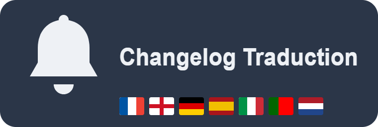

# Changelog Traduction

<table>
<tr>
<td>

</td>
<td width="110" align="right">

</td>
</tr>
</table>

A Home Assistant custom integration that watches your `update.*` entities and, when an update becomes available, fetches its real release notes and has an AI Task entity translate/summarize them into your language — delivered as a persistent notification and/or a mobile push notification.

*[Français ci-dessous](#français)*

---

## English

### What it does

- Watches every `update.*` entity (HACS integrations, Supervisor add-ons, Home Assistant Core/Supervisor/OS).
- Fetches the actual release notes, depending on the source:
  - **GitHub-hosted integrations (most HACS repos):** via the public GitHub Releases API.
  - **Supervisor add-ons:** via Supervisor's own changelog endpoint (the same one the HA frontend uses internally).
  - **Home Assistant Core:** its release-notes web page is fetched and handed to the AI, which extracts the relevant content itself.
  - If none of these yield anything, a plain "update available" notice is sent — never invented content.
- Translates/summarizes the result with your configured AI Task entity (e.g. Google Generative AI), in **your** language — by default Home Assistant's own interface language (`hass.config.language`), or a language you pick explicitly in the config screen.
- Sends the result as a persistent notification and/or a push notification to the device you choose.
- Notifies once per version (tracked internally), so no repeat spam on every HA restart.
- Optional **alert mode**: only notify when a release contains breaking changes (renamed/removed entities or services, required configuration migrations...), as classified by the AI, instead of translating/summarizing every update.
- All settings can be changed at any time from the integration's **Configure** option, no need to remove and re-add it.

-------------------------------------------------------------------------------------------------------------------------------------------------------------------
### Screenshots

**1. Look for the integration under Devices and Services**

-------------------------------------------------------------------------------------------------------------------------------------------------------------------
**2. Configure the integration**

-------------------------------------------------------------------------------------------------------------------------------------------------------------------
**3. Native Home Assistant notifications**

-------------------------------------------------------------------------------------------------------------------------------------------------------------------
**4. Detailed notifications by Changelog Traduction**

-------------------------------------------------------------------------------------------------------------------------------------------------------------------

### Requirements

- An **AI Task** entity already configured (e.g. Google Gemini, OpenAI, Ollama, or any other AI Task provider).
- [HACS](https://hacs.xyz) installed (recommended), or manual installation.

Don't have an AI Task entity yet? Quick free setup with Google Gemini

1. Get a free API key at [aistudio.google.com/app/apikey](https://aistudio.google.com/app/apikey).
2. In Home Assistant: **Settings → Devices & services → Add integration → "Google Gemini"**, paste the key.
3. If no AI Task entity shows up automatically, open the integration card's **⋮ menu → Add entry** and add one.

-------------------------------------------------------------------------------------------------------------------------------------------------------------------
### Installation

**Via HACS (custom repository):**
1. HACS → ⋮ menu → Custom repositories → add this repository's URL, category "Integration".
2. Install "Changelog Traduction", restart Home Assistant.
3. Settings → Devices & services → Add integration → search "Changelog Traduction".
4. Pick your notification entity and your AI Task entity. Leave the language field empty to follow Home Assistant's interface language, or set one explicitly. Everything here — including the new alert mode — can be revisited later from the integration's **Configure** option.

**Manual installation:**
1. Copy the `custom_components/changelog_traduction/` folder into your `config/custom_components/` directory.
2. Restart Home Assistant (a full restart — reloading the integration alone won't pick up new files).
3. Add the integration as above.
   
-------------------------------------------------------------------------------------------------------------------------------------------------------------------  
### Privacy

- This integration is read-only: it never installs updates, never touches your configuration, and never controls any device.
- The release notes text (fetched from GitHub, Supervisor, or the Home Assistant release-notes page) is sent to whichever **AI Task entity you configured** so it can translate/summarize it. Depending on the provider you chose (Google Gemini, OpenAI, a local Ollama model, etc.), that text may leave your Home Assistant instance to reach that provider's servers — the same way it would for any automation you build with that AI Task entity.
- Nothing is sent anywhere if there is no pending update, and no other data (entities, history, personal information) is ever included.

-------------------------------------------------------------------------------------------------------------------------------------------------------------------
### Known limitations

- Add-on changelog access relies on an internal, undocumented part of the `hassio` integration — if a future HA release changes it, this simply falls back to the generic message, without breaking anything else.
- Home Assistant Core's release notes come from a general web page (not a per-version API), so extraction quality depends on the AI correctly ignoring navigation/footer noise.
- The public GitHub API is rate-limited to 60 requests/hour without authentication.
- Only a handful of languages have hand-written fallback strings (used only when translation itself fails); everything else defaults to English for those specific strings. The AI-generated translations themselves work in any language you configure.

-------------------------------------------------------------------------------------------------------------------------------------------------------------------
### License

See [LICENSE](LICENSE).

---

## Français

### Ce que ça fait

- Surveille toutes les entités `update.*` (intégrations HACS, add-ons Supervisor, Home Assistant Core/Supervisor/OS).
- Récupère les vraies notes de version, selon la source :
  - **Intégrations hébergées sur GitHub (la plupart des dépôts HACS) :** via l'API publique GitHub Releases.
  - **Add-ons Supervisor :** via le point d'accès changelog interne de Supervisor (le même qu'utilise l'interface HA).
  - **Home Assistant Core :** sa page web de notes de version est récupérée puis confiée à l'IA, qui en extrait elle-même le contenu pertinent.
  - Si aucune de ces sources ne donne de résultat, un simple message "mise à jour disponible" est envoyé — jamais de contenu inventé.
- Traduit/résume le résultat via ton entité AI Task configurée (ex : Google Generative AI), dans **ta** langue — par défaut celle de l'interface Home Assistant (`hass.config.language`), ou une langue choisie explicitement dans l'écran de configuration.
- Envoie le résultat en notification persistante et/ou notification push vers l'appareil de ton choix.
- Ne notifie qu'une fois par version (suivi en interne), donc pas de spam à chaque redémarrage de HA.
- Mode **alerte** optionnel : ne notifie que si une version contient des changements majeurs (entités/services renommés ou supprimés, migration de configuration requise...), classés par l'IA, au lieu de traduire/résumer systématiquement chaque mise à jour.
- Tous les réglages peuvent être modifiés à tout moment depuis l'option **Configurer** de l'intégration, sans avoir à la supprimer/réinstaller.
  
-------------------------------------------------------------------------------------------------------------------------------------------------------------------
### Captures d'écran

**1. Integration a chercher dans appareils et services**

-------------------------------------------------------------------------------------------------------------------------------------------------------------------
**2. Configuration de l'intégration**

-------------------------------------------------------------------------------------------------------------------------------------------------------------------
**3. Notifications natives Home Assistant**

-------------------------------------------------------------------------------------------------------------------------------------------------------------------
**4. Notifications détaillées par Changelog Traduction**

-------------------------------------------------------------------------------------------------------------------------------------------------------------------
### Prérequis

- Une entité **AI Task** déjà configurée (ex : Google Gemini, OpenAI, Ollama, ou tout autre fournisseur AI Task).
- [HACS](https://hacs.xyz) installé (recommandé), ou installation manuelle.

Pas encore d'entité AI Task ? Configuration rapide et gratuite avec Google Gemini

1. Récupère une clé API gratuite sur [aistudio.google.com/app/apikey](https://aistudio.google.com/app/apikey).
2. Dans Home Assistant : **Paramètres → Appareils et services → Ajouter une intégration → "Google Gemini"**, colle la clé.
3. Si aucune entité AI Task n'apparaît automatiquement, ouvre le menu **⋮ → Ajouter une entrée** sur la carte de l'intégration et ajoutes-en une.

-------------------------------------------------------------------------------------------------------------------------------------------------------------------
### Installation

**Via HACS (dépôt personnalisé) :**
1. HACS → menu ⋮ → Dépôts personnalisés → ajoute l'URL de ce dépôt, catégorie "Integration".
2. Installe "Changelog Traduction", redémarre Home Assistant.
3. Paramètres → Appareils et services → Ajouter une intégration → cherche "Changelog Traduction".
4. Choisis ton entité de notification et ton entité AI Task. Laisse le champ langue vide pour suivre la langue de l'interface HA, ou fixe-en une explicitement. Tout ceci — y compris le nouveau mode alerte — peut être modifié plus tard depuis l'option **Configurer** de l'intégration.

**Installation manuelle :**
1. Copie le dossier `custom_components/changelog_traduction/` dans ton dossier `config/custom_components/`.
2. Redémarre complètement Home Assistant (un simple rechargement de l'intégration ne suffit pas pour prendre en compte de nouveaux fichiers).
3. Ajoute l'intégration comme ci-dessus.

-------------------------------------------------------------------------------------------------------------------------------------------------------------------
### Confidentialité

- Cette intégration est en lecture seule : elle n'installe jamais de mise à jour, ne touche jamais à ta configuration, et ne contrôle aucun appareil.
- Le texte des notes de version (récupéré depuis GitHub, Supervisor, ou la page de notes de version de Home Assistant) est envoyé à **l'entité AI Task que tu as configurée** pour qu'elle le traduise/résume. Selon le fournisseur choisi (Google Gemini, OpenAI, un modèle Ollama local, etc.), ce texte peut quitter ton instance Home Assistant pour rejoindre les serveurs de ce fournisseur — exactement comme pour n'importe quelle automatisation utilisant cette même entité AI Task.
- Rien n'est envoyé s'il n'y a pas de mise à jour en attente, et aucune autre donnée (entités, historique, informations personnelles) n'est jamais incluse.

-------------------------------------------------------------------------------------------------------------------------------------------------------------------
### Limites connues

- L'accès aux changelogs des add-ons repose sur une partie interne et non documentée de l'intégration `hassio` — si une future version de HA la change, ça retombe simplement sur le message générique, sans casser le reste.
- Les notes de version de Home Assistant Core viennent d'une page web générale (pas d'une API par version), donc la qualité de l'extraction dépend de la capacité de l'IA à ignorer le bruit de navigation/pied de page.
- L'API GitHub publique est limitée à 60 requêtes/heure sans authentification.
- Seules quelques langues ont des messages de repli écrits à la main (utilisés uniquement si la traduction elle-même échoue) ; les autres langues utilisent l'anglais par défaut pour ces messages précis. Les traductions générées par l'IA, elles, fonctionnent dans n'importe quelle langue configurée.

-------------------------------------------------------------------------------------------------------------------------------------------------------------------
### Licence

Voir [LICENSE](LICENSE).

---

### ☕ Enjoying this integration?

**EN** — If it saves you time, consider buying me a coffee. It keeps this project maintained and new features coming.

**FR** — Si cette intégration te fait gagner du temps, un petit don est toujours apprécié : ça m'aide à maintenir le projet et à ajouter de nouvelles fonctionnalités.

